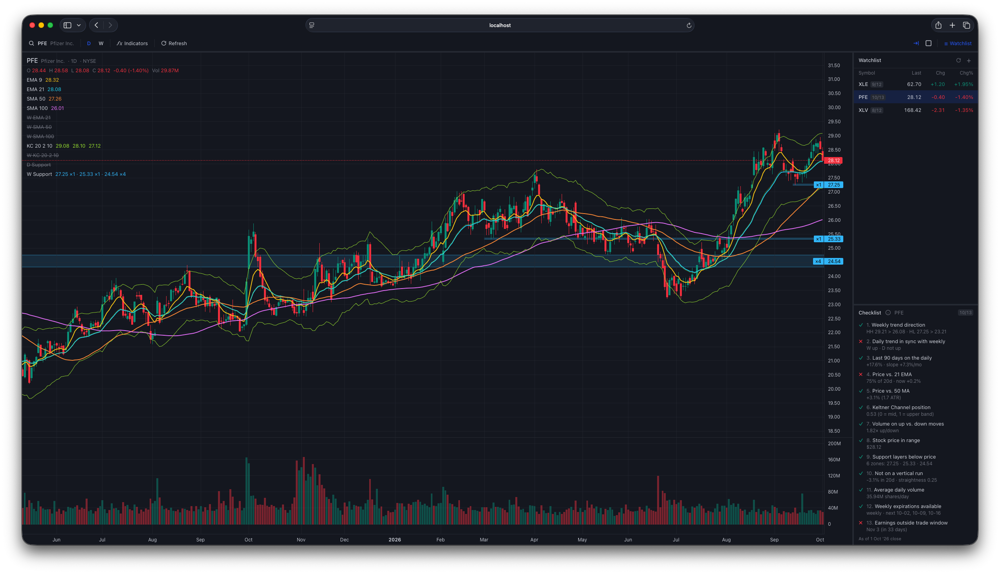

# Kaching v3



A TradingView-style charting app for picking stocks for the Kaching weekly options strategy. You can search any Yahoo Finance symbol, chart it with daily and weekly EMAs and Keltner Channels, and keep a watchlist. Data is fetched incrementally into a local SQLite database.

- **Backend:** Python, FastAPI, yfinance, SQLite (`kaching/`)
- **Frontend:** React, TypeScript, Vite, Tailwind, [Lightweight Charts](https://github.com/tradingview/lightweight-charts) (`frontend/`)

## Quick start (Docker)

```bash
docker build -t kaching .
docker run --rm -p 8000:8000 -v "$PWD/data:/data" kaching
open http://localhost:8000
```

The container binds `0.0.0.0` and has no auth, so don't expose the port beyond your machine.

## Development

Run the backend and frontend in two terminals:

```bash
# 1. API on :8000
python3 -m venv .venv && source .venv/bin/activate
pip install -r requirements-dev.txt
python -m kaching serve --reload

# 2. Vite dev server on :5173 (proxies /api to :8000)
cd frontend && npm install && npm run dev
```

Tests:

```bash
pytest                      # backend (yfinance is mocked, no network)
cd frontend && npm test     # frontend pure-logic tests (Vitest)
cd frontend && npm run typecheck
```

`python -m kaching serve` also serves `frontend/dist` when it exists, so after `npm run build` the whole app runs on one port.

## Using the app

| Feature | How |
|---|---|
| Symbol search | Click the symbol in the top-left. Search Yahoo by ticker or company name, then use ↑/↓/Enter. An unstored symbol gets all available daily history fetched automatically (e.g. KO back to 1962). If search can't find a symbol, pressing Enter tries the typed text as-is |
| Timeframe | **D** / **W** in the top bar. On **D**, weekly indicators draw as step lines. On **W**, only weekly indicators are shown |
| Indicators | **ƒx Indicators** to toggle each one and set its colour, width, length and Keltner params. Hover a legend row for quick hide (eye) or settings (gear). Settings are global and saved in the DB |
| Watchlist | **+** adds via search. Drag rows to reorder. Hover a row and click **✕** to remove it. **⟳** force-fetches every symbol. Prices refresh when the app loads |
| Refresh | Opening a symbol fetches new bars if its data is more than 5 minutes old. **Refresh** in the top bar forces a fetch |
| Links | The URL tracks state (`/?symbol=AAPL&tf=W`), so bookmarks and reloads reopen the same view |

## Indicators

| Indicator | Daily | Weekly |
|---|---|---|
| EMA 9 | ✓ | |
| EMA 21 / 50 / 100 | ✓ | ✓ (hidden by default) |
| Keltner Channel: EMA(20) mid, ±2.0 × ATR(10) | ✓ | ✓ |

- ATR uses Wilder (RMA) smoothing, the same as TradingView's `ta.atr`.
- Weekly bars are resampled from daily bars into weeks ending Friday, labelled by their Monday as TradingView does. The current week uses its in-progress values.
- Indicators are computed in Python over the full stored history, so EMA warm-up is correct. EMA 100 on a weekly chart needs about 2 years of data.
- Prices are **adjusted** for splits and dividends.

## Chart Checklist

The 14-item Chart Checklist from `strategy-rules.md`, measured in `kaching/analysis/checklist.py`.
Each check reports its value, its threshold and ✓ / ✗ / – (not applicable). The app shows it under
the watchlist for the active symbol, with an `X/14` badge per watchlist row; the CLI has `check`.

| # | Check | Pass when |
|---|---|---|
| 1 | Weekly trend | last two weekly swing highs and lows rising, close above the last swing low |
| 2 | Daily in sync | the same higher-high / higher-low test on daily bars also up |
| 3 | Last 90 days | 63-bar return > 0 and regression slope > 0 |
| 4 | vs 21 EMA | ≥ 80% of the last 20 closes above it, and above now |
| 5 | vs 50 SMA | above by ≥ 1 ATR(14) |
| 6 | Keltner position | 5-day average of (close − mid) / (upper − mid) between 0.5 and 1.1 |
| 7 | Volume | up-day ÷ down-day volume over 50 days ≥ 1.0 (n/a without volume data, e.g. funds) |
| 8 | Price in range | last close $25–$300 |
| 9 | Support layers | ≥ 2 weekly support zones below price |
| 10 | Not a vertical run | fails only if up > 15% in 20 days **and** in a near-straight line (efficiency ratio ≥ 0.4) |
| 11 | Average volume | 50-day average ≥ 1M shares (n/a for funds) |
| 12 | Weekly expirations | an option expiration in each of the next 4 weeks |
| 13 | Earnings window | next earnings more than 8 weeks away (n/a if no date) |
| 14 | Sector ETF | the stock's sector ETF passes checks 1–3; relative strength vs SPY shown |

#12–#13 use option expirations and the next earnings date from Yahoo, cached per ticker for a
day (`kaching/market_info.py`); the chart's Refresh button refetches them. #14's ETF is suggested from
Yahoo's industry, then sector (edit the map in `kaching/analysis/sector_etfs.json`), and can be
overridden per ticker on checklist row #14. Thresholds are constants
at the top of `checklist.py`. The checklist uses the strategy's own
parameters, so the chart's indicator settings don't affect it.

## CLI

The web app covers everything, but the CLI is handy for scripting or bulk loads:

```bash
python -m kaching fetch AAPL MSFT NVDA               # all history (default MAX); or --period 5Y / --start 2020-01-01
python -m kaching list
python -m kaching check NVDA AMD                     # Chart Checklist; or --watchlist
python -m kaching serve [--host 0.0.0.0] [--port 8000] [--reload]

# in Docker
docker run --rm -v "$PWD/data:/data" kaching fetch AAPL
```

## Storage and incremental fetching

There's one SQLite DB (`KACHING_DB`, default `data/kaching.db`; `/data/kaching.db` in Docker) with these tables:

- `bars(ticker, date, open, high, low, close, volume)`: daily bars
- `symbols(ticker, name, exchange, last_fetched)`: names for the UI and the fetch throttle
- `watchlist(ticker, position)`
- `settings(key, value)`: indicator config as JSON

The app fetches **all available history** for a new symbol. Symbols stored with less (e.g. via
`fetch --period 5Y`) are backfilled once, the next time the app opens them; `symbols.full_history`
records that it's done.

When you fetch a ticker that's already stored:

1. **New dates.** Only bars after the latest stored date are downloaded. The latest bar is always rewritten, because a fetch during market hours stores a partial day.
2. **Backfill.** If the requested start is earlier than the stored history, only the missing older range is downloaded.
3. **Auto-heal.** Yahoo re-adjusts history after splits and dividends. Each fetch re-checks one stored bar, and if its close has changed, that ticker's history is deleted and refetched.

If Yahoo is unreachable, a stored symbol still charts from the DB, and the legend shows "offline, showing stored data".

## API

| Method | Path | |
|---|---|---|
| GET | `/api/search?q=` | Yahoo symbol search (equities, ETFs, indices) |
| GET | `/api/chart/{ticker}?tf=D\|W&refresh=0\|1` | Bars + indicators. Fetches if the ticker is unstored or its data is stale |
| GET / PUT / DELETE | `/api/settings/indicators` | Read, save or reset the indicator config |
| GET / PUT | `/api/watchlist` | Read the watchlist, or replace it with `{symbols: [...]}` in order |
| POST | `/api/watchlist/refresh?force=` | Fetch the latest bars for all watchlist symbols |

Interactive docs are at `/docs` while the server is running.

## Layout

```
kaching/
  api.py         FastAPI routes; serves frontend/dist
  cli.py         fetch / list / serve
  fetcher.py     yfinance download, lookback parsing, incremental + auto-heal
  db.py          SQLite schema and queries
  indicators.py  EMA, ATR, Keltner, weekly resampling, default indicator config
frontend/src/
  App.tsx, store.ts (Zustand UI state), theme.ts
  api/           typed client + TanStack Query hooks
  components/    Chart, Legend, TopBar, SymbolSearch, Watchlist, IndicatorSettings
  lib/           formatting, series transforms, URL state (+ tests)
```
